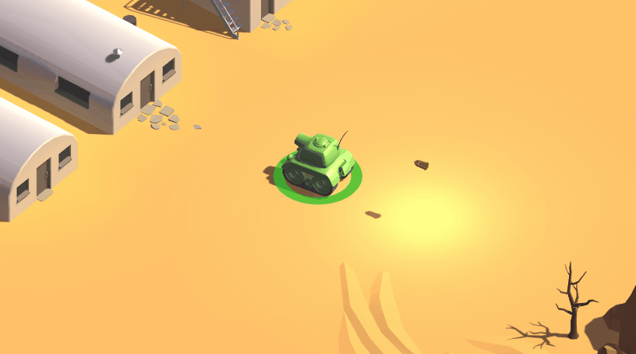

# Tanks Combat

## Plan

坦克大战程序的编写大致分为下面8个阶段。

1. PROJECT & SECNE SETUP
2. TANK CREATION & CONTROLS
3. CAMERA
4. HEALTH
5. SHELLS
6. SHOOTING
7. GAME MANAGERS
8. AUDIO

## PHASE 1. PROJECT & SECNE SETUP 

### 步骤

- 设置场景，将Prefabs\Level Art拖入Hierarchy中。
- 设置Window\Lighting Panel，并且Build Precomputed Realtime GI。（全局光照的原理？？）
- 设置Main CameraGameObject。

> TODO: 学习Window\Lighting Panel的用法，[Choosing a Lighting Technique](https://unity3d.com/learn/tutorials/topics/graphics/choosing-lighting-technique?playlist=17102)。弄清为啥这个项目中使用Precomputed Realtime GI Lighting。

### 新知识GET --- TODO

## PHASE 2. TANK CREATION

### 步骤

- 将Models\Tank拖入Hierarchy中，设置Tank GameObject 的Layer为 Players。
- 添加Rigidbody component，限定位置坐标的Y轴，限定旋转轴X轴和Z轴。
- 添加Box Collider。
- 设置Audio Source component。
- 将Tank GameObject拖入Prefabs中。

- 设置Tank GameObject移动时的轨迹，使用到Prefabs\DustTrail这个粒子效果。
- 将Scripts/Tank中的TankMovement.cs拖到Tank GameObject上，编写之。
  - 获取用户输入（旋转\平移）
   - 设置音频切换（Move\Idle）
   - 进行平移运动
   - 进行转向运动
 - 在Inspector窗口中，设置Tank Movement(Script)的相关变量的值。点击Apply按钮将上面的修改应用到Prefabs\Tank上。

现在，我们的Tank可以自由移动，旋转，并且有对应的音效。但，我们想让摄像机也跟随Tank运动。所以进入第三步。

[TankMovement.cs](scripts/TankMovement.cs)

### 新知识GET

`AudioSource.pitch`，The pitch of the audio source. 

## PHASE 3. CAMERA

相机的要求：

1. 投影类型：正交投影
2. 跟随两个坦克
3. 保持两个坦克一直在视野内

### 步骤

- 添加CameraRig GameObject，并将Main Camera作为其子对象。设置CameraRig的Rotation，设置Main Camera的Position。
- 编写脚本 CameraControl.cs，附加到CameraRig GameObject上，负责移动CameraRig，以及设置Camera的orthographicSize进行Zoom。（Zoom脚本的编写蛮有意思，是在CamraRig局部空间中进行操作，找到目标orthographicSize值）
- 脚本中使用到了`Vector3.SmoothDamp`以及`Mathf.SmoothDamp`用来平滑相机的移动和缩放。
- **需要注意的是**，相机的移动以及Zoom操作放在FixedUpdate函数下，因为其所跟踪的物体是在FixedUpdate下进行运动的。

[CameraControl.cs](scripts/CameraControl.cs)

### 新知识GET

| Function                            | Detail                                                      |
| ----------------------------------- | ----------------------------------------------------------- |
| `Vector3.SmoothDamp()`              | Gradually changes a vector towards a desired goal over time |
| `Mathf.SmoothDamp()`                | Gradually changes a value towards a desired goal over time  |
| `Transform.InverseTransformPoint()` | Transforms `position` from world space to local space       |

## PHASE 4. HEALTH

### 步骤

- 新建一个GameObject\UI\Slider。编辑，得到一个环形的、渲染模式为世界空间的HealthSlider。其对应的Canvas GameObject作为Tank的子对象。
- 编写脚本UIDirectionControl.cs，控制HealthSlider是否随着Tank的旋转而旋转。
- 编写脚本TankHealth.cs
  - 设置Tank受到伤害的一系列数值更新
  - 根据Tank的当前Health来更新HealthSlider
  - Tank对象的DeActive

[UIDirectionControl.cs](scripts/UIDirectionControl.cs)

[TankHealth.cs](scripts/TankHealth.cs)

## PHASE 5. SHELLS

- 将Model\Shell模型拖入Hierarchy中，并将ShellExplosion到Shell GameObject下作为子对象。
- 在ShellExplosion GameObject中添加Audio Source Component。
- 编写ShellExplosion .cs脚本
  - 寻找被影响的Tank
  - 对Tank应用伤害
  - 对Tank应用外力
  - Unparent the particles from the shell，播放声音和粒子特效
  - 清理Shell GameObject 以及 ShellExplosion GameObject
- 将脚本附加到Shell GameObject上，并且将ShellExplosion拉入公共变量框Explosion Particles, Explosion Audio Source中。

[ShellExplosion.cs](scripts/ShellExplosion.cs)

### 新知识GET

- `LayerMask`，用来提供过滤选项，按照GameObject所属的Layer进行过滤。这里使用Player layer来过滤得到Tank GameObject。
- `Physics.OverlapSphere()`，返回一个Collider数组，每个Collider都与Sphere相交。
- `Destroy()`，销毁对象。
- 三种主要的Collider类型：**Static Collider**，**Rigidbody Collider**，**Kinematic Rigidbody Collider**。这里，我们的Shell设置为Rigidbody Trigger Collider。Trigger用来检测Shell进入到其他Collider的空间，而不去实际发生碰撞。使用OnTriggerEnter()来进行一系列的处理。

## PHASE 6. SHOOTING

- 写UI（AimSlider），用来显示发射子弹时的力度。
- 写TankShooting.cs脚本，控制子弹发射以及更新AimSlider。

[ShellExplosion.cs](scripts/TankShooting.cs)

## 扩展任务

坦克被物体遮挡后，显示出边框，方便玩家操作。
